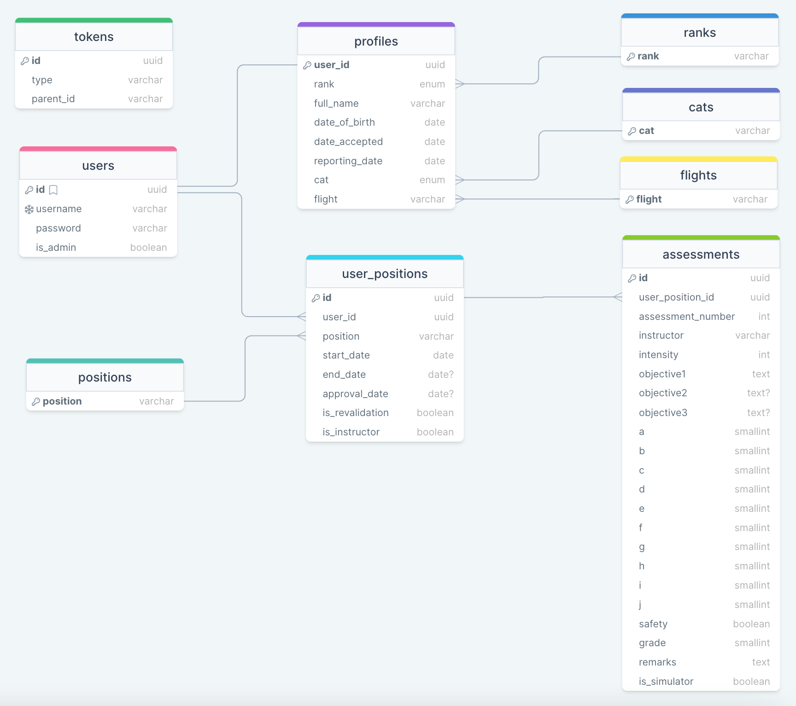

# Trainee Assessment Portal

The Trainee Assessment Portal (TAP) is envisioned to be a one-stop portal for both trainees and instructors to archive, monitor and process graded assessments. This project is tended for the fulfillment of the academic requirements of the Software engineering Immersive programme from General Assembly.

## Table of Contents

1. [Background](#background)
2. [Description](#description)
3. [Technologies Used](#technologies-used)
4. [Application Structure](#application-structure)
5. [List of Form Validations](#list-of-form-validations)
6. [Back-End API End Points](#back-end-api-endpoints)
7. [Database Structure](#database-structure)
8. [Outstanding List of Features](#outstanding-list-of-features)

## Background

Trainees presently print out a hardcopy assessment form which their instructors will fill up as the session progresses. After the session is completed, trainees will file the assessment form in their training file for archival and for future instructors to view their progress.

Some issues with the present system is that forms may go missing during the course, causing a gap in the trainees' progress, or checks done at the end of the course highlight that some forms were not filled in according to audit standards.

With the current system of hardcopy assessment forms, any kind of processing requires staff to manually tabulate and analyse data to turn it into useful information.

## Description

The TAP's first goal is to reduce the excessive paper usage generated by the training process. While the TAP itself will not be able to achieve this goal, it takes the first step in the digitalisation of the training process. The TAP currently requires trainees to manually input their assessment details into the portal, but the envisioned outcome is for a digital device to be used during the session (instead of the hardcopy form) to input the assessment details directly into the portal.

THe TAP's second goal is to eliminate mistakes made in the process of filling up the assessment forms. The submission form for adding assessments has a comprehensive list of validations to ensure that the assessment details adhere to the strict audit standards. Trainees will not be able to submit the assessment if any of the criteria is not met.

The TAP's third goal is to provide instructors and management the ability to analyse and process the assessment data input by the trainees. The monitoring of a trainee's progress is crucial in providing a tailored training experience. Instructors need to be able to identify a trainee's strengths and weaknesses early on to maximise a trainee's potential. The TAP provides a dashboard with visual representations of both individual and aggregated data (not implemented yet) for instructors and management to easily obtain an overview of the status of training.

## Technologies Used

The TAP is a PERN stack application, utilising ReactTS for the front-end, ExpressJS for the back-end and Postgres for the database. The TAP is hosted in AWS utilising AWS's 12-month free services of EC2 and RDS (not implemented yet).

BCrypt is used for the hashing of passwords while JSONWebToken is used to manage local sessions.

Charts are generated using D3 and their associated libraries.

## Application Structure

Displayed below is the envisioned structure of the application. Components not yet implemented are indicated with a _[not implemented]_ tag.

```
--> Root (/)
    |--> Login (/login)
         |--> Login page for registered users.
         |--> Generates Refresh and Access Tokens. Refresh Token is stored in Local Storage.
         |--> Global states are automatically populated after login.
    |--> Account Creation (/register)
         |--> Account creation with username and password. All accounts are tagged as non-admin by default.
         |--> Counts as a login and thus will generate Refresh and Access Tokens. Refresh Token is stored in Local Storage.
         |--> Global states are automatically populated after account creation.
    |--> Home Dashboard (/home) [not implemented]
         |--> Dashboard Section to indicate a trainee's progress in their selected position. Includes Live-Sim Ratio, Average Grades, Scenario Percentage Completion and Training Deadlines
    |--> Assessments (/assessments)
         |--> Summary
              |--> Position Selector with a dropdown that includes all of the positions the trainee is training in or has trained in.
              |--> 'New Position' button for trainees to add a new position. [not implemented]
              |--> A grade chart is displayed, showing a graph of the trainee's assessments in the selected position.
         |--> Assessments Table
              |--> Tabular display of all the trainee's assessments for the selected position.
              |--> Trainee is able to add new assessments from this page through the 'Add Assessment' button
              |--> Each assessment is displayed as a row in the table. Trainees are able to edit the assessment details or delete the assessment if it is no longer required.
              |--> All available fields will be automatically populated when editing an assessment.
              |--> Validations are present in both 'Add' and 'Edit' modes to ensure proper submission.
              |--> Assessments are sorted by Assessment Number
    |--> Profile (/profile)
         |--> If no profile is detected, the 'Create Profile' view is displayed.
              |--> Trainees are presented with a form to fill up their trainee profile. All fields are required.
         |--> Profile Details Section is split into two views - 'Display' and 'Edit'.
              |--> Display view displays the trainee profile details
              |--> Edit view displays inputs for trainee to edit their profile details and to change their password
                   |--> The password must always be entered twice to save the edited profile
                   |--> Details such as username and rank and name cannot be updated by the user. Can only be edited through the Admin panel.
         |--> Positions Table
              |--> Tabular display of all the trainee's positions
              |--> Trainee is able to add new positions from this page through the 'Add Position' button
              |--> Each position is displayed as a row in the table. Trainees are able to edit the position details or delete the position if it is no longer required.
              |--> Positions are sorted by Start Date.
    |--> Admin Panel (/admin)
         |--> Contains 6 sub-views for Users, User Positions, Ranks, Flights, Positions and CATs.
         |--> Only available to admin accounts.
         |--> Users View
              |--> Contains Rank, Name, Username, Password and a flag for Admin status. All fields are editable.
              |--> Password is null by default. If a null password is submitted, it will not be changed.
              |--> Admins will not be able to delete their own account.
         |--> User Positions View - contains Rank, Name, Position, Approval Date and a flag for Instructor status. All fields less Rank and Name are editable.
         |--> Ranks View
              |--> Contains all Ranks.
              |--> Ranks are sorted alphabetically.
              |--> Deleting a rank will set all users with said rank to 'null'. Users will have to manually set their new rank.
         |--> Positions View
              |--> Contains all Positions.
              |--> Positions are sorted alphabetically.
              |--> Deleting a position will set all users with said position to 'null'. Users will have to manually set their new position.
         |--> Flights View
              |--> Contains all Flights.
              |--> Flights are sorted alphabetically.
              |--> Deleting a flight will set all users with said flight to 'null'. Users will have to manually set their new flight.
         |--> CATs View
              |--> Contains all CATs.
              |--> CATs are sorted alphabetically.
              |--> Deleting a CAT will set all users with said CAT to 'null'. Users will have to manually set their new CAT.
    |--> Logout (/logout)
         |--> Logs the user out and redirects them to the Login screen.
         |--> Removes the Refresh Token from Local Storage and resets all global states.
```

## List of Form Validations

The TAP provisions for a comprehensive list of validation criteria before the respective forms can be submitted. The forms and their associated validation criteria are listed below.

1. **Login Form**

   - Existance of user account
   - Validity of password

2. **New Account Form**

   - Availability of username
   - Accuracy of password

3. **New Profile Form**

   - Population of all fields
   - Chronology of Date Accepted and Date of Birth fields
   - Chronology of Reporting Date and Date Accepted fields

4. **Edit Profile Form**

   - Population of all fields
   - Chronology of Date Accepted and Date of Birth fields
   - Chronology of Reporting Date and Date Accepted fields
   - Accuracy of password

5. **New and Edit Position Form**

   - Population of Position and Start Date fields
   - Chronology of End Date and Start Date fields
   - Chronology of Approval Date and End Date fields
   - Population of End Date field if Approval Date is specified

6. **New and Edit Assessment Form**

   - Population of all fields less Simulator status and Objectives 2 and 3
   - Population of Objective 2 field if Objective 3 is specified
   - Validity of Grade fields (between 1 and 10 (inclusive))

## Back-End API Endpoints

API endpoints are broken up into 6 main categories as follows.

### **Users (/user)**

1.  **Create (/user/create)** - Creation of user account
2.  **Login (/user/login)** - User login
3.  **Update (/user/update/:user_id)** - Updating of user password
4.  **Delete (/user/delete/:user_id)** - Delete of user account (includes deleting associated profile, user positions and respective assessments)
5.  **Logout (/user/logout)** - User logout

### **Profiles (/profile)**

1.  **Get (/profile/get/:user_id)** - Retrieve profile for specified user
2.  **Create (/profile/create)** - Create new profile
3.  **Update (/profile/update/:user_id)** - Update profile for specified user

### **User Positions (/user_position)**

1.  **Get (/user_position/get/:user_id)** - Retrieve all positions for specified user
2.  **Create (/user_position/create/:user_id)** - Create new position for specified user
3.  **Update (/user_position/update/:user_position_id)** - Update specified position
4.  **Delete (/user_position/delete/:user_position_id)** - Delete specified position

### **Assessments (/assessment)**

1.  **Get (/assessment/get/:user_position_id)** - Retrieve all assessments for specified user position
2.  **Create (/assessment/create/:user_position_id)** - Create new assessment for specified user position
3.  **Update (/assessment/update/:assessment_id)** - Update specified assessment
4.  **Delete (/assessment/delete/:assessment_id)** - Delete specified assessment

### **Miscellaneous (/misc)**

1.  **Enum (/misc/enum)** - Retrieve all enum tables (ranks, flights, positions, CATs)
2.  **Refresh (/misc/refresh)** - Refresh Access Token

### **Admin (/admin)**

1.  **Get Users (/get/users)** - Retrieve all user accounts together with rank and name
2.  **Get User Positions (/get/user_positions)** - Retrieve all user positions together with rank and name
3.  **Get Ranks (/get/ranks)** - Retrieve all ranks
4.  **Get Positions (/get/positions)** - Retrieve all positions
5.  **Get CATs (/get/cats)** - Retrieve all CATs
6.  **Get Flights (/get/flights)** - Retrieve all flights
7.  **Create Ranks (/put/rank)** - Create new rank
8.  **Create Positions (/put/position)** - Create new position
9.  **Create CATs (/put/cat)** - Create new CAT
10. **Create Flights (/put/flight)** - Create new flight
11. **Update Users (/patch/users/:user_id)** - Update account details and/or rank and name for specified user
12. **Update User Positions (/patch/user_positions/:user_position_id)** - Update position, approval date and instructor status for specified user position
13. **Update Ranks (/patch/ranks/:rank)** - Update specified rank
14. **Update Positions (/patch/positions/:position)** - Update specified position
15. **Update CATs (/patch/cats/:cat)** - Update specified CAT
16. **Update Flights (/patch/flights/:flight)** - Update specified flight
17. **Delete Users (/delete/users/:user_id)** - Delete specified user and associated profile, positions and assessments
18. **Delete User Positions (/delete/user_positions/:user_position_id)** - Delete specified user position and associated assessments
19. **Delete Ranks (/delete/ranks/:rank)** - Delete specified rank
20. **Delete Positions (/delete/positions/:position)** - Delete specified position
21. **Delete CATs (/delete/cats/:cat)** - Delete specified CAT
22. **Delete Flights (/delete/flights/:flight)** - Delete specified flight

## Database Structure

The TAP utilises Postgres as its relational database management system. The tables and relationships are displayed below.

`Database: tap`

### Tables

1. Users
2. Profiles
3. User_Positions
4. Assessments
5. Ranks
6. Flights
7. CATs
8. Positions
9. Tokens

### Relationships



## Outstanding List of Features

- Home Dashboard
- Instructor Screens
- Implementing Redux
- Deployment to AWS
